# Funds Transfer Service

## 0. Description

FTS, which stands for Funds Transfer Service, is a virtual project for mobile wallet payment related service.

The general requirement for the project is as follows:

    Originally specialized in payment, MobileWallet 2020 wants now to provide a fund transfer solution across its user base. 

    First version of that new service is API base, as development lead, you have been assigned the job developing an online API for the new funds transfer service.
    
    By API, users should be able to check their balance, transfer money to another user, retrieve a summary of their transactions

## 1. Software Architecture

As described in above section, this is a Server side API project, we are currently focusing on the backend implementation of the service.  

We use [Golang](https://golang.google.cn/) as major development language and leverage the light-weighted web framework [Gin](https://github.com/gin-gonic/gin) to serve as HTTP Server, on which lives two major services: __Account Service__ and __Transaction Service__. All of the APIs are [RESTful](https://en.wikipedia.org/wiki/Representational_state_transfer), which means user can access them through HTTP, using tools such as curl, PostMan, etc.

The service could be deployed locally and also support containerized deployment, we recommend the latter and you could find more details in following sections.

The system data storage component is based on [MySQL v5.7.30](https://dev.mysql.com/downloads/mysql/5.7.html). Golang code use [gorm](https://gorm.io/) framework to access MySQL.

We opened __/metrics__ API for industry popular tools such as [Prometheus](https://prometheus.io/) and [Grafana](https://grafana.com/). 

They will pull all kinds of well-defined system metrics for system monitoring and data analysis use.

All those tools and components mentioned above could be deployed through container.

## 2. Installation

### 2.1 Minikube & Docker environment setup

For demo & development use, we recommend use all-in-one setup instead of clusters. All the jobs could be done on local laptop environment, here gives examples based on Windows 10 Home Edition PC. For Mac/Linux users, steps and details may be diverse, but should be easier than Windows :-)

The detailed installation processes are omitted here since they could be easily found on Internet.

After installation, for Windows 10 Home edition case, the Minikube envionment runs like this:

In our demo case, The Minikube Virtualbox VM's IP is 192.168.99.100.

The Windows 10 local Docker environment is based on Docker Toolbox solution (since Home edition is officially not recommended enable Hyper-V.)  
The Docker engine also runs in a Virtualbox VM and Windows side Docker client uses MING-w64 to talk with it. In our demo case, this VM IP is 192.168.99.104.

Of course we can put all things in one VM, but in our demo case, the two VMs are both used:
   - FTS container and MySQL container run on 192.168.99.104;
   - Prometheus and Grafana container run on 192.168.99.100.

### 2.2 Major components deployment

In this section, we talk about phase I solution: plain Docker deployment of the service. It means that different services run in different Docker containers and interact with each other. But we do not use any container orchestration tools yet.

In phase II, we will leverage Kubernetes/Minikube to do container orchestration.
You could see details in TODO section.

#### 2.2.1 Docker image pull

docker pull mysql:5.7.30

docker pull grafana/grafana

docker pull quay.io/prometheus/prometheus

#### 2.2.2 Docker image build

(1) git clone the project

(2) modify cfg/db.ini
  
    [DB]
  
    dialect=mysql           //db driver info needed by gorm
    host=192.168.99.104     //the host IP where FTS runs
    port=3306               //MySQL port
    user=root               //MySQL connection parameter
    passwd=123456           //MySQL connection parameter
    name=fts                //MySQL database name for FTS.

(3) docker build . -t fts:0.1

#### 2.2.3 Docker image run

- MySQL

Since FTS will connect to database at the very beginning, so we __MUST__ let MySQL ready first:

docker run --name mysql -d -p 3306:3306  -v $PWD:/var/lib/mysql-files -e MYSQL_ROOT_PASSWORD=123456  --rm -d mysql:5.7.30

Create database for FTS project.

There are two methods to do this:

(1) Use SQL.

    docker exec -it <docker_container_id> bash
    
    mysql -u root -p
    
    create database fts;

(2) Use management GUI tools such as Navicat for MySQL.

- FTS

docker run -d -p 8080:8080 --name=fts --rm fts:0.1

- Prometheus

(1) From FTS git clone directory, copy cfg/prometheus.yaml to the VM where Prometheus will runs. For this demo case, it is on 192.168.99.100, /home/docker is the $HOME.

(2) Modify the content of the yaml file like this:

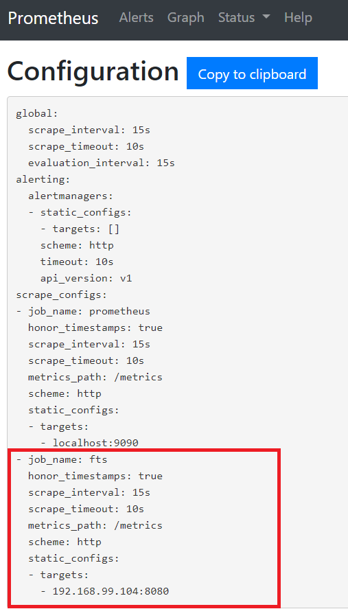

(3) run container:

docker run -d -p 9090:9090 --name=prometheus --rm -v /home/docker/prometheus.yml:/etc/prometheus/prometheus.yml quay.io/prometheus/prometheus

(4) check if the configurations edited above take effect:

Open Prometheus page in web browser with this URL: http://192.168.99.100:9090/targets

Check if an named "fts" endpoint is there and if it works well:

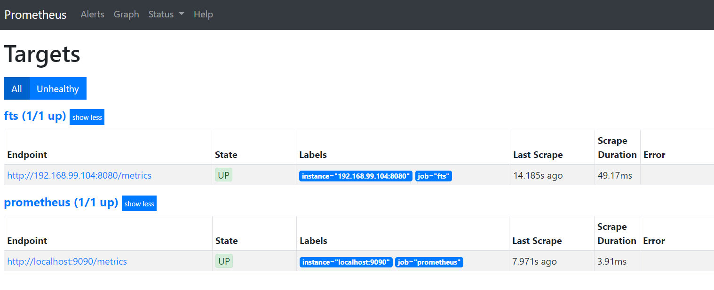

- Grafana

docker run -d -p 3000:3000 --name=grafana --rm -e "GF_INSTALL_PLUGINS=grafana-clock-panel,grafana-simple-json-datasource" grafana/grafana

Similar as Prometheus, we could access Grafana portal at:
http://192.168.99.100:3000/login, the initial credential is "admin/admin", you will be asked to modify it when you first login.

In Grafana, configure the data source like this:

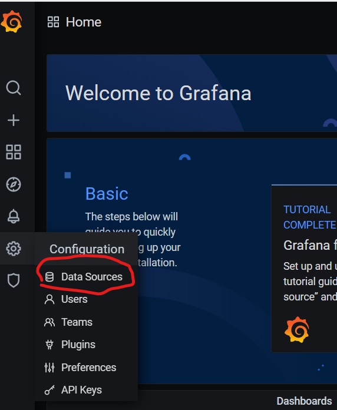

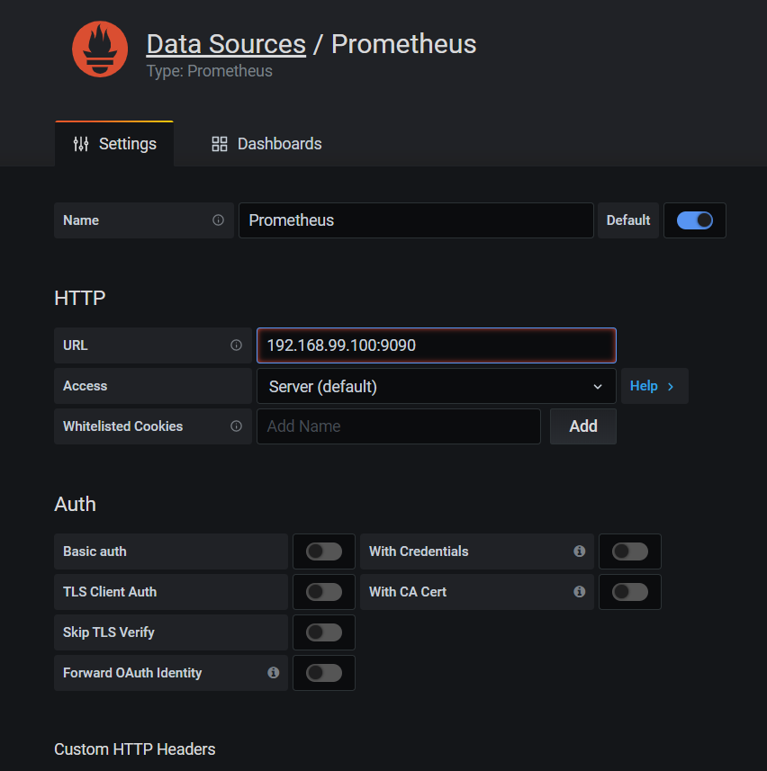

There is a simple demo grafana dashboard file saved in JSON under project  directory: cfg/grafana_dashboard.json

We can import it to see the effect, here is a demo picture captured earlier:

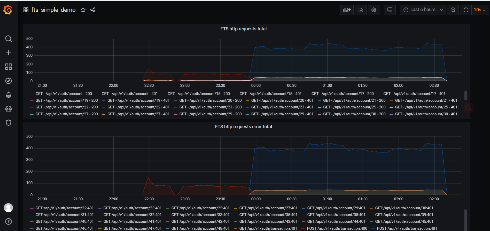

See more details in section 3.2

## 3. Instructions

### 3.1 REST API

   In FTS project, we leverage the [Swagger](https://swagger.io/) toolkit to manage and facilitate our REST APIs.

   Since our code is Golang based and hosts in Gin framework, we chose [gin-swagger](https://github.com/swaggo/gin-swagger) to generate API document.

   When FTS container runs up, you could use below URL to access it:
   http://192.168.99.104:8080/swagger/index.html

    As long as we add necessary formatted annotations before our code API functions, they will be exposed in this page and guide the user how to go with them.

    The web page is user-friendly and you can use it to do simple test of those APIs.

    Here use Swagger page to give the basic API usage and use cases work flow intruction:

    1. User registration.

   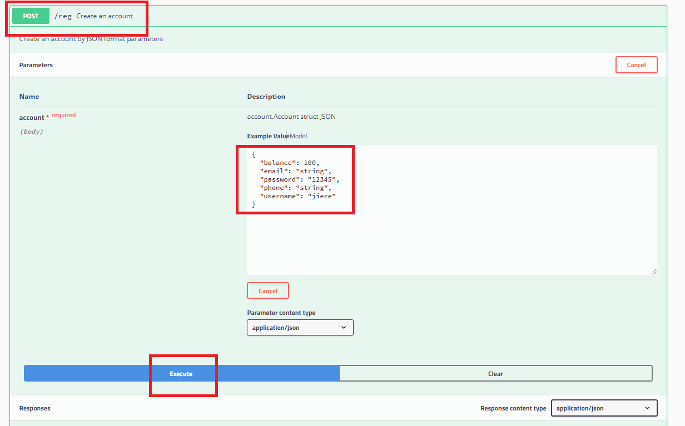

    2. User login.

   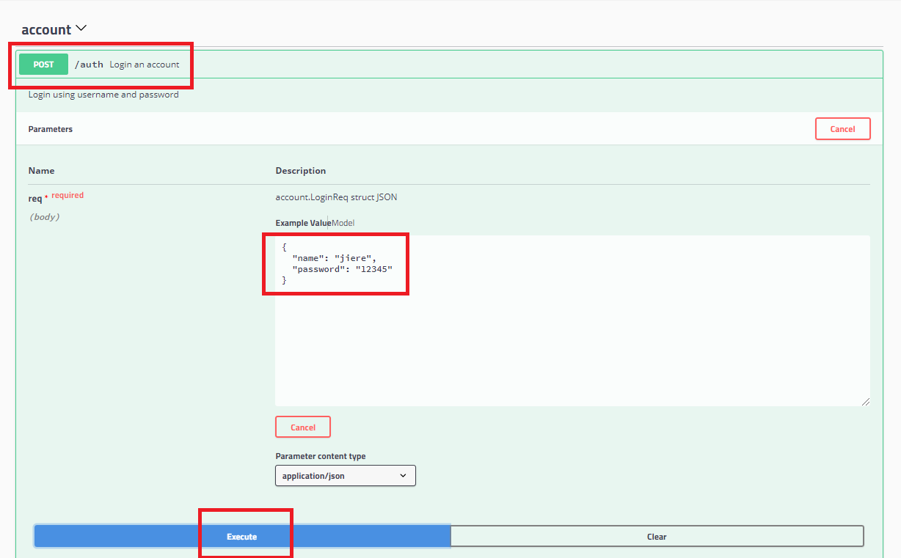

    3. Token generated when login success. 
    
   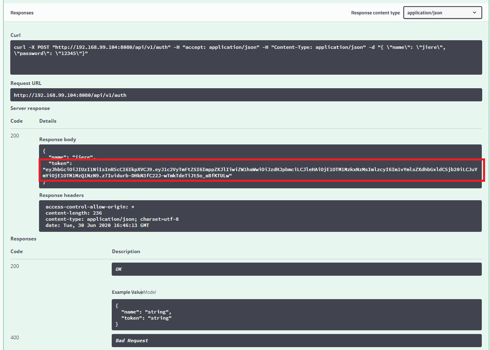

    Token will expired by default in an hour, if see such words in HTTP response body: "token is expired", need to re-login and generate a new token.

    4. Token need to authorize, otherwise, operations will be blocked.

   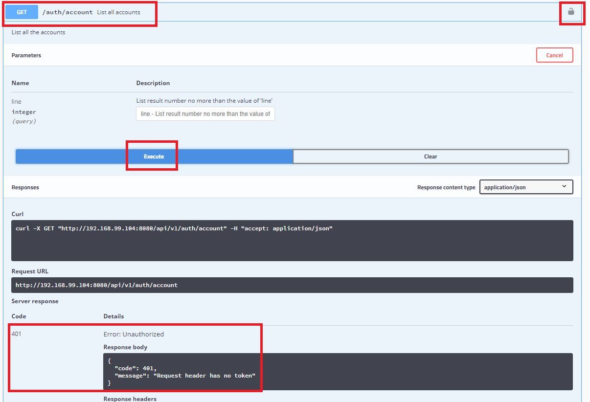

    5. Authorize the token.

   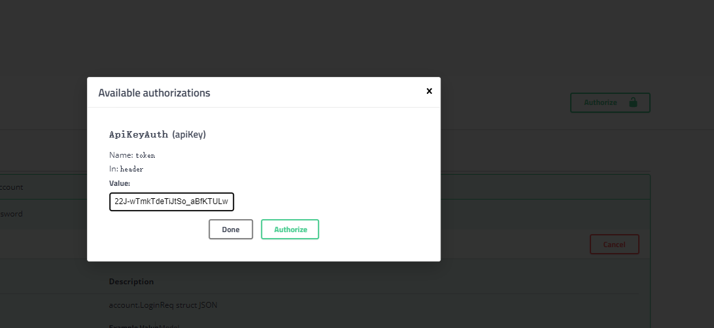

    6. Operations normal with token.

   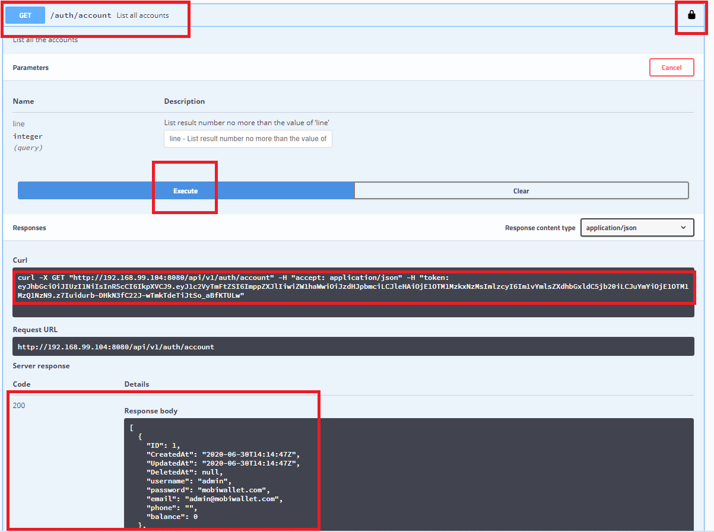

    7. Transfer money.

   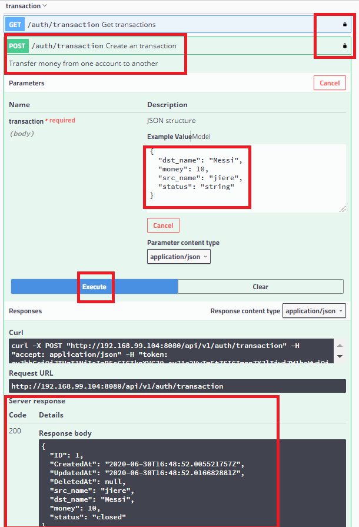

    8. Check the transaction record.

   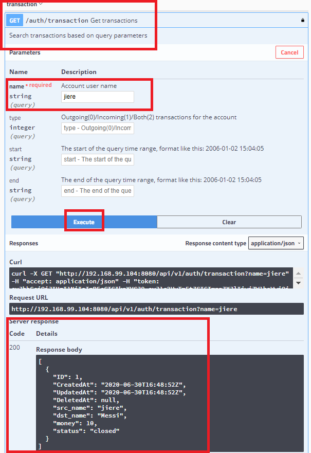

### 3.2 Prometheus/Grafana usage

    The typical work flow is like this:

    step 1. FTS implement metrics and expose data through /metrics API;
    
    step 2. Prometheus setup target and pull metrics periordically;
    
    step 3. Use Prometheus functions and PromQL to do initial analysis;
    
    step 4. Visualization in Grafana.

    The Grafana offical docker image has limited dashboard/plugin resources in, we should search them on web and download ones if necessary.

    Grafana dashboard could be saved as JSON and recovered by import. 

    The more important things for Prometheus/Grafana is the metrics design, how to utilize the data and how to dig out more values.

    In the current code, we implemented three major metrics, they are:
    
    ftp_http_request_duration (Histogram)

    fts_http_request_total (Counter)
    
    fts_http_request_error_total (Counter)

### 3.3 client tool usage

To facilitate demo and debug, we developed a simple Go client tool to access those APIs FTS exposed.

The client tool codes are all under project /client directory.

We leveraged [Swagger codegen](https://swagger.io/tools/swagger-codegen/) tool to establish the primitive code stubs and added our project logic there. 

The tool is quite simple currently, the major functions are:
    
    (1) API function test

    (2) API stress test

    (3) Data generator for Prometheus/Grafana.

By default it acts for 2 and 3 above, and it is now not support CLI parameters(due to some Golang flag package issues need to fix), so we should build it from directory as below instructions:

    a. run into /client directory, run "go mod init main" to set up the go module
    
    b. open IDEs such as VS code, import the whole client folder, search "package swagger" and replace it to "package main", currently there are 11 places need to change.

   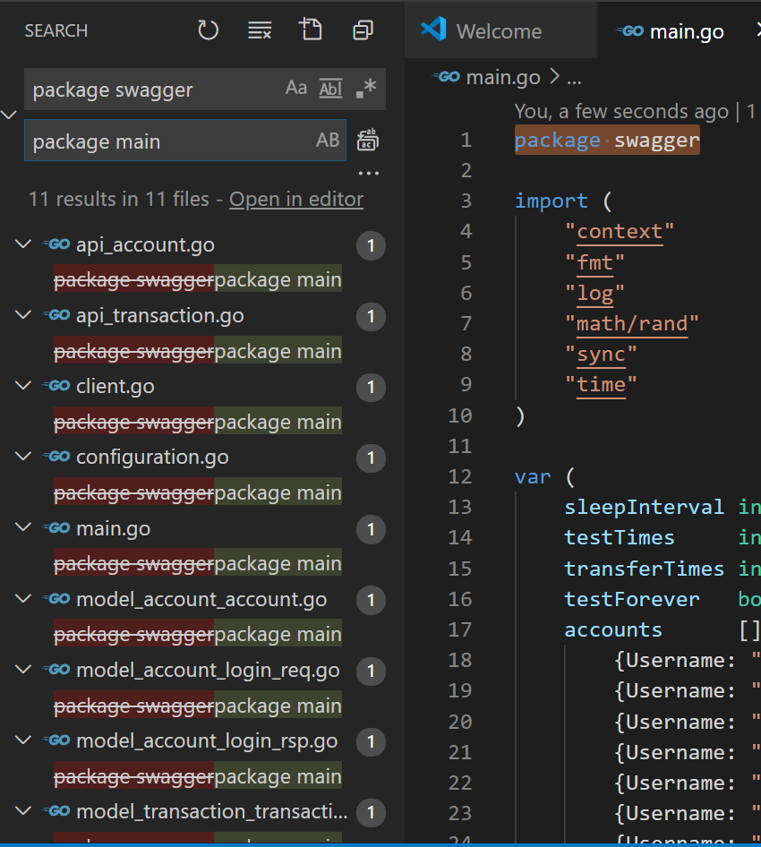
    
    c. go build . under the /client, and have fun.
    
    d. Those test parameters are hardcoded in main.go and by default the test is endless unless you press Ctrl+C, you can choose to change them when you build, and we will support CLI configuration in future.

### 3.4 project files hierarchy

    - cfg               // configuration files.

    - client            // client tool code

    - deploy            // Kubernetes deployment related

    - pkg
        - account       // The Account Service related code

        - transaction   // The Transaction Service related code

    - utils             // Common tools and libs
        - db.go         // DB related
        - error.go      // uniform format and metrics counter
        - jwt.go        // JSON Web Token for authentication.
        - monitor.go    // metrics related
        - ut.go         // unit test related

## 4 TODO

The project is quite young currently, and need continous contribution.

The major improvement aspects are as follows:

1. Minikube orchestration and service discovery improvement.
    
    The current configuration files could only be short-term solution, we must support container orchestration and service discovery in future, obsolete those files such as db.ini, etc.

2. UT enhancement

    Currently we could run "./ut.sh" under the root directory of the project to do UT and collect code coverage data.

    There are still various issues in docker build, see [details](https://github.com/golang/go/issues/26988), so we diabled UT in Dockfile temporarily.

    The current UT coverage for the two major packages is not so good, especially for those gorm related code, it is not so easy to mock them, go-sqlmock sounds good, but still need more effort to dig some tricky issues.  

3. Front-end support if needed.
